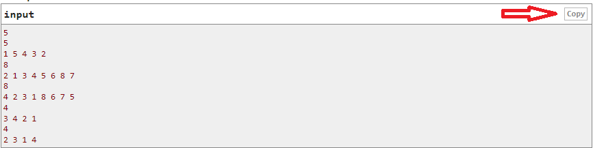

# CF C++ Guide

This guide will go through the basics of taking input with C++ in Codeforces.

Unlike Leetcode, Codeforces requires you take and parse the input you're given, and print out the answer.
When your program is ran, it should be able to take input exactly as given.
A good way to test is to paste the input straight into your IDE, where your output should exactly match the given output, including newlines.



## Template
Base template, I recommend starting with this if you have never touched CF before. Feel free to customize as you see fit.
```c++
// Includes all the goodies like vector, string, iostream etc
// If your IDE doesn't like it, either swap it out with the includes you need or look up how to install it
#include <bits/stdc++.h>
using namespace std;

// Globals go here

void solve(){

    // do something

    cout << "answer" << endl;
}

int main(){
	ios_base::sync_with_stdio(0);
    cin.tie(0);
	int tc = 1;
	cin >> tc; //comment out if 1 case
	while(tc--)
		solve();
	return 0;
}
```

## Compiler
Recommended:
GNU G++17 or GNU G++20

## Taking Input
cin takes input until whitespace or newline character.
It's our job to process the input into the format we want.
A way of taking a whole line as input is to use getline with stringstream.

**Example 1:**
> The first line contains an integer **t**. Then **t** test cases follow
> The first line of each test case contains one integer **n**
> The second line contains **n** distinct integers
> 
> Example:
> 2
> 5
> 1 5 4 3 2
> 8
> 2 1 3 4 5 6 8 7

In this case, the 2 is dealt with by our template.
Our solve function would then look like:
```python
void solve(){
    int n;
    cin >> n;
    vector<int> a;
    for (int i=0;i<n;i++)
        cin >> a[i];
    
}
```


**Example 2:**
> The first and the only line of the input file contains two numbers **n** and **r**
> 
> Example:
> 3 5

There is only 1 test case in each test so we need to change our main function to
```c++
int main(){
	  ios_base::sync_with_stdio(0);
        cin.tie(0);
	  int tc = 1;
	  //cin >> tc; //comment out if 1 case
	  while(tc--)
		    solve();
	  return 0;
}
```

```c++
void solve(){
    int n, r;
    cin >> n >> r;
}
```
